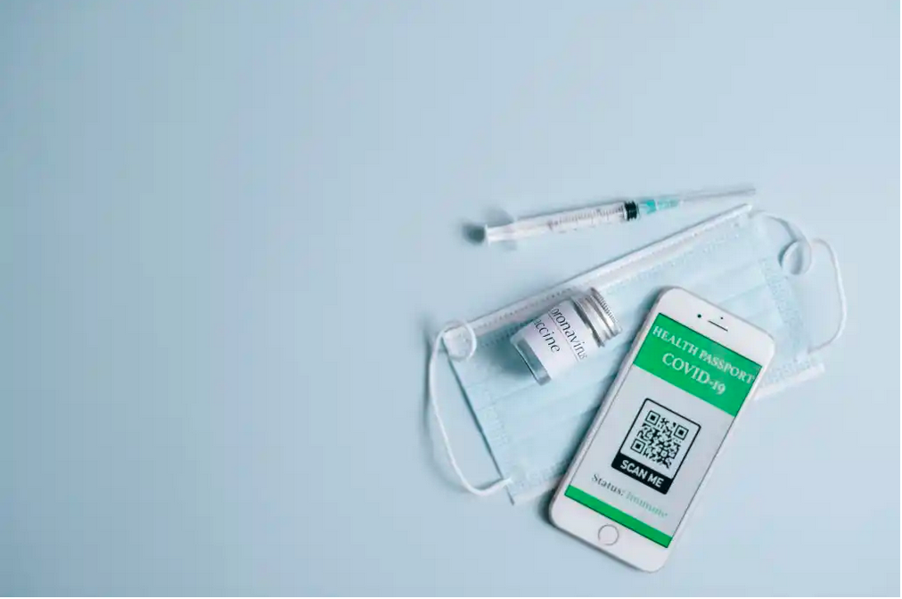

Photo by [Olya Kobruseva](https://www.pexels.com/photo/white-and-green-plastic-tube-8383884/) on Pexels.com

Today is Monday August 9, 2021. This morning, [Premier Iain Rankin promised](https://twitter.com/IainTRankin/status/1424710134698106883?s=20) that if he is re-elected on August 17, then there will be vaccine passports for access to non-essential services (movie theatres, restaurants, bars, gyms, etc). While he did express concern for marginalized populations, Premier Rankin made zero comment on the possibility of being exempt from the vaccine passport if you are ineligible for vaccination. He went so far as to say “Nova Scotians who are doubly vaccinated will go to concerts, hockey games, and other activities without having to worry [that] the person they’re sitting next to is not vaccinated” (3:13 in the video).

Why am I worried about this? I have both of my shots, but after our second doses, my identical twin brother and I ended up in hospital (for 2 and 3 days, respectively): I was diagnosed with **myopericarditis** (inflammation of the heart and the sac around it) and my brother was diagnosed with **myocarditis**. Given that this happened in identical twins, it is clear that post-vaccination myocarditis is probably related to a genetic cause. As such, Public Health has refused to give my sister the second shot, and my brother and I are not allowed to get boosters if they become necessary in the future. Other than my immediate family, I also have some extended family who are exempt from receiving one of the vaccines due to severe allergy to one or more ingredient(s). I’m also aware that there are people who are allergic to ingredients in all the vaccines, or who cannot get them for various other medical reasons.

I still support the vaccines. I became briefly skeptical while in the hospital, but I was pissed off that this happened to me, and I now understand that I simply rolled snake eyes on a pair of 10,000 sided dice. I do not, however, support vaccine passports that marginalize those who cannot get vaccinated from the rest of civil society. Allow me to explain why.

### What do I mean by “vaccine ableism”?

**Ableism** is “[discrimination in favour of able-bodied people](https://www.google.com/search?q=ableism+definition&hl=en&sxsrf=ALeKk01dvOfYX56FtR6gPVd4EUqqega6qw%3A1628533655914&source=hp&ei=l3MRYbTrM9at5NoPlcunsA8&iflsig=AINFCbYAAAAAYRGBp4yHAURP2WKzRzJsiy6rphFYP74m&oq=ableism+definition&gs_lcp=Cgdnd3Mtd2l6EAMyCQgjECcQRhD5ATIECAAQQzIFCAAQgAQyBQgAEIAEMgUIABCABDIGCAAQFhAeMgYIABAWEB4yBggAEBYQHjIGCAAQFhAeMgYIABAWEB46BAgjECc6CAgAEIAEELEDOgsIABCABBCxAxCDAToICAAQsQMQgwE6BwgAELEDEEM6DQgAEIAEEIcCELEDEBQ6CwguEIAEEMcBEK8BOgoIABCABBCHAhAUOgwIIxCxAhAnEEYQ-QE6BAgAEAo6CAgAEBYQChAeUI4EWIEWYIsXaAJwAHgAgAG6AogBoRCSAQgxMy4zLjIuMZgBAKABAQ&sclient=gws-wiz&ved=0ahUKEwj0kr_QyKTyAhXWFlkFHZXlCfYQ4dUDCAw&uact=5).” So, vaccine ableism is simply discrimination in favour of those who are able to get the vaccine.

Without an exemption process for those who cannot get the vaccine, vaccine passports risk creating vaccine ableism. This could mean that those who cannot get the vaccine will not be allowed access to non-essential services, such as restaurants and gyms, but they will be allowed access to essential services like grocery stores.

The above definition of vaccine ableism is, on the face of it, morally benign, because it does not come with a statement as to whether there are cases where such discrimination is justified. If you support vaccine passports, you certainly think some type of discrimination is justified–particularly, discrimination against anti-vaxxers who refuse to get the vaccine. I’m not interested in objecting to or defending vaccine passports here; I think most people probably think it is okay to discriminate against anti-vaxxers because **anti-vaxxers are not unable, but are rather unwilling to get the vaccine**. I’m interested in the moral consequences of discriminating against those who are unable to get the vaccine.

I believe that if vaccine passports are mandated, then it is wrong to use them to discriminate against those who are unable to get the vaccine.

### What’s wrong with vaccine ableism?

I’ll start by steel-manning the vaccine ableist position.

The vaccine ableist may argue that the vaccines are not 100% effective, so it is best to minimize risk as much as possible by not allowing anybody without a vaccine to enter crowded, non-essential areas. [Breakthrough cases happen](https://www.cdc.gov/vaccines/covid-19/health-departments/breakthrough-cases.html), and those who are unlucky enough to have a breakthrough infection are just as infectious as the unvaccinated person who catches COVID-19. If we put a bunch of vaccinated people together without any unvaccinated people, we minimize the risk of spreading further breakthrough infection. Furthermore, one could say that it’s okay to discriminate against the vaccine exempt for non-essential services, but not for essential ones. After all, one could live the life of a hermit that only leaves the house to go grocery shopping. That minimizes the COVID-19 risk to both the vaccine exempt person and the crowd trying to enjoy a concert, bar, gym, etc.

I think that such a vaccine ableist argument misses the point of vaccine passports entirely. I’ll explain why by laying out what I think is probably the most realistic end-goal for dealing with COVID-19 (**Hint**: It’s not #zeroCOVID).

Let’s say in 6 months from now, we’re all living life pretty much totally normally again in Canada. Lots of people will continue to wear masks, especially during flu season, but overall we’re basically back to normal within our country. In that situation, we’ll probably be looking at ~85% of the population being vaccinated, in the best case scenario. The other 15% will be made up of the children too young to get vaccinated, and of the vaccine exempt adults. At that point, we should have herd immunity. Herd immunity is as good as it is possibly going to get with this virus, and we might not even achieve that. **But by having really strong population-level immunity, we protect the 15% of people who can’t get vaccinated so that they can return to living life safely again**.

Now imagine that you’re at a restaurant where vaccine passports are required. By gathering with a lot of other people in a concentrated area, you’re effectively creating a temporary herd-within-a-herd–a subpopulation within the total population. If 85% of restaurant patrons (or, likely a lot more than that given the setting) are vaccinated, that’s as good as sitting in a restaurant 6 months from now without vaccine passports. **That’s as safe as it’s going to get**.

Ideally, it would be nice if everyone was vaccinated, but that’s just not the reality we live in. If you think that the vaccine exempt should not be allowed entry to non-essential services, then why don’t you believe that the vaccine exempt should be permanently locked away?

The vaccine ableist may counter and say that these services are non-essential, so it’s not a moral issue to say that the vaccine exempt shouldn’t be allowed access. But what exactly makes these services non-essential? Is it the fact that we can survive with only the bare minimum? Social interaction is necessary for good mental and physical well-being. These services are only non-essential in the sense that we don’t absolutely need them to survive during the most serious pandemic in a century. It doesn’t mean that we can just leave the vaccine exempt to wither away alone in their homes while the rest of us hang out at movie theatres and concerts. **The whole point of vaccine passports is to vaccinate those who are able to get vaccinated, so that we can protect everyone, including those who are unable to get vaccinated**.

### Conclusion

I’ve brought the vaccine ableist position to its logical extreme: An ideal world in which you never have to encounter an unvaccinated person ever. I hope to have shown that vaccine ableism aims for an impossible end that can only come close to being achieved through morally reprehensible means.

None of this is to say that the vaccine exempt shouldn’t have to go and get tested a couple times a week. Perhaps that can be their responsibility, just like getting vaccinated is the responsibility of those who are able to.

I simply want to make sure the vaccine exempt are not excluded from the conversation around vaccine passports. We’ve all been stuck inside for the last 18 months, and we’re all sick of this stupid pandemic. We shouldn’t be leveraging our fear from the last 18 months to harm those who need protection the most: The vulnerable, including children, the immunocompromised (vaccinated or unvaccinated) and the vaccine exempt adult population. **The vaccines work, and if you’re a vaccinated person sitting in a restaurant full of other vaccinated persons and a handful of exempt others, you are going to be fine**.

Until next time,

Nicholas Murray